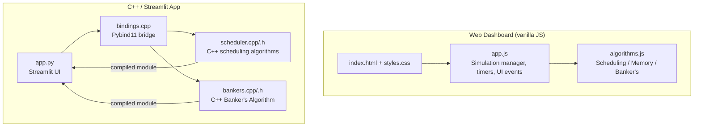
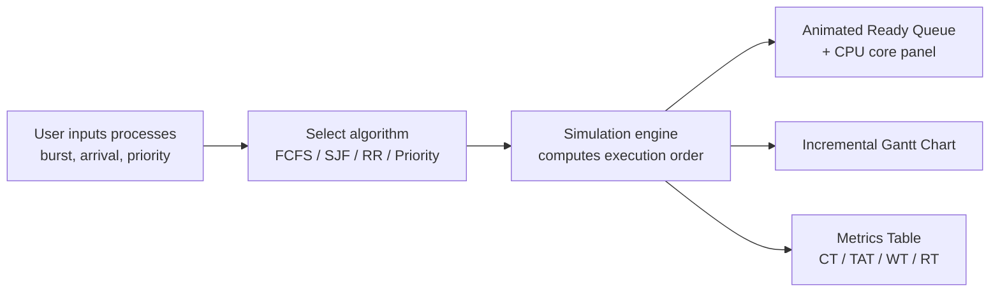

<div align="center">

# 🖥️ OS Simulator
### Operating System Simulator — Scheduling · Memory Management · Deadlock Avoidance

An interactive, high-fidelity simulator that models core Operating System concepts with real-time visualizations — available as both a **zero-dependency web dashboard** and a **C++/Pybind11-powered Streamlit app**.

[](#)
[](#)
[](#)
[](#)

</div>

---

## 📖 Overview

**OS Simulator** brings three classic Operating Systems topics to life with step-by-step, animated visualizations instead of static textbook diagrams:

- **Process Scheduling** — watch processes move through a ready queue and execute on a CPU core in real time
- **Memory Management** — visualize partition allocation, fragmentation, and page replacement frame-by-frame
- **Deadlock Avoidance** — walk through the Banker's Algorithm as it builds a safe sequence (or proves none exists)

The repo ships **two independent implementations** of the same ideas:

| Implementation | Stack | Why it exists |
|---|---|---|
| 🌐 **Web Dashboard** | Vanilla HTML/CSS/JS, zero dependencies | Instant, no-install demo — just open `index.html` |
| ⚙️ **C++ + Streamlit App** | C++ core algorithms, exposed to Python via `pybind11`, UI in Streamlit | Shows performance-critical native code driving a Python data-app UI |

---

## ✨ Key Features

### 1️⃣ Process Scheduler
- **Algorithms**: FCFS, SJF (preemptive & non-preemptive), Round Robin (configurable time quantum), Priority Scheduling (preemptive & non-preemptive)
- **Visualizations**: animated ready-queue cards, live CPU core execution panel, incremental real-time Gantt chart, and an auto-updating metrics table (Completion, Turnaround, Waiting, Response Time)

### 2️⃣ Memory Manager
- **Dynamic Allocation**: First Fit, Best Fit, Worst Fit — with a scanning-pointer animation showing internal fragmentation and free-space coalescing
- **Page Replacement**: FIFO, LRU, and Optimal — step-by-step frame-state tables with green/red hit-and-miss indicators

### 3️⃣ Deadlock Avoidance
- **Banker's Algorithm**: enter resource instances plus Allocation/Max matrices, and watch the safety check evaluate each process step-by-step to build a **Safe Sequence** — or flag a deadlock

---

## 🧭 How It Works



### Scheduling Simulation Flow


---

## 🛠️ Tech Stack

| Layer | Technology |
|---|---|
| Web UI | HTML5, CSS3 (dark mode, glassmorphism, animations), vanilla JavaScript |
| Native Core | **C++** (scheduling & Banker's algorithm implementations) |
| Python Bridge | **Pybind11** (exposes C++ classes/functions to Python) |
| Data App UI | **Streamlit** |
| Build Tooling | `setup.py`, `compile.sh` (macOS quick-build script) |
| Package Management | `requirements.txt` (Python deps) |

---

## 📂 Directory Structure

```
os-simulator/
├── index.html            # Web Dashboard layout
├── styles.css             # Custom CSS for dark-mode, glassmorphism, animations
├── app.js                 # Core UI events, timer loops, simulation manager
├── algorithms.js          # JS implementation of scheduling/memory/Banker's algorithms
├── README.md              # Project documentation (this file)
└── cpp_simulator/         # C++ / Pybind11 / Streamlit implementation
    ├── src/
    │   ├── scheduler.h    # C++ scheduling headers
    │   ├── scheduler.cpp  # C++ scheduling implementation
    │   ├── bankers.h      # C++ Banker's algorithm headers
    │   ├── bankers.cpp    # C++ Banker's algorithm implementation
    │   └── bindings.cpp   # Pybind11 bindings exposing classes to Python
    ├── app.py              # Streamlit dashboard calling the C++ library
    ├── setup.py            # Build/compile script for the C++ module
    ├── compile.sh          # Quick compile script for macOS
    ├── requirements.txt    # Python package requirements
    └── README.md           # Compilation & build instructions
```

---

## 🚀 Quick Start

### Option A — Web Dashboard (zero dependencies)
```bash
# Simply open index.html directly, or serve it locally:
python3 -m http.server 8000
```
Then open **http://localhost:8000** in your browser.

### Option B — C++ / Streamlit App
See [`cpp_simulator/README.md`](cpp_simulator/README.md) for full build instructions. Typical flow:
```bash
cd cpp_simulator
pip install -r requirements.txt
./compile.sh          # or: python setup.py build_ext --inplace
streamlit run app.py
```

---

## 🗺️ Roadmap
- [ ] Add Multilevel Queue / Multilevel Feedback Queue scheduling
- [ ] Add Segmentation alongside paging in Memory Manager
- [ ] Deadlock **detection** (not just avoidance) via resource-allocation graphs
- [ ] Exportable simulation reports (PDF/CSV)

---
